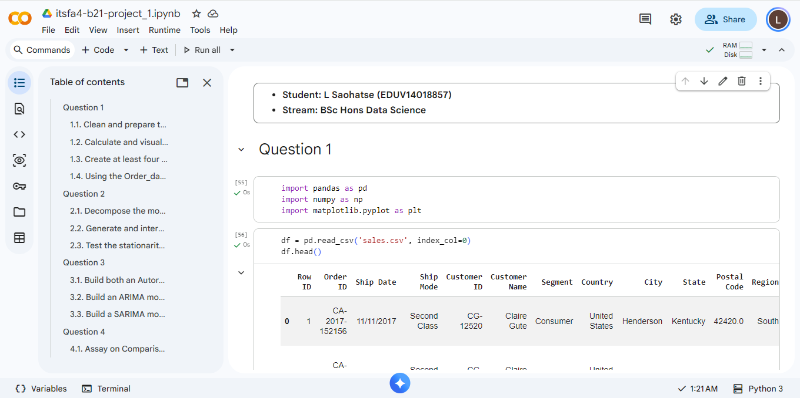

# Retail Sales Analysis & Time Series Forecasting



## Overview

This project presents a complete retail sales analysis and time series forecasting workflow using Python. The analysis starts with data cleaning and exploratory analysis before progressing into monthly sales aggregation, visualisation, time series decomposition, stationarity testing, autocorrelation analysis, and multiple forecasting techniques. The main objective was to understand historical retail sales patterns and evaluate different statistical forecasting models for predicting future monthly sales.


---

## Dataset

The dataset contains retail sales transactions with information relating to:

- Order IDs
- Order dates
- Ship dates
- Ship modes
- Customers
- Customer segments
- Geographic locations
- Product categories
- Product sub-categories
- Product information
- Sales values

The dataset contains **9,800 records and 18 columns**.

The analysis converts the transaction-level data into a monthly sales time series containing **48 monthly observations from January 2015 to December 2018**.

---

# What I Did

## 1. Data Cleaning and Preparation

The first stage involved inspecting and preparing the dataset for analysis.

The following steps were performed:

- Loaded the dataset using Pandas.
- Inspected the structure and data types.
- Converted `Order_Date` and `Ship Date` into datetime variables.
- Standardised text columns by removing unnecessary whitespace.
- Converted the postal code field into an appropriate string representation.
- Rounded sales values to two decimal places.
- Checked for duplicate records.
- Checked for missing values.
- Investigated missing postal codes.
- Corrected the 11 missing postal codes associated with Burlington, Vermont.

After cleaning, the dataset contained no remaining missing values.

---

## 2. Exploratory Sales Analysis

### Sales by State

Total sales were aggregated by state to understand geographic sales performance.

The analysis showed substantial differences between states.

The highest-performing states included:

1. California - $446,306.43
2. New York - $306,361.07
3. Texas - $168,572.40
4. Washington - $135,206.87
5. Pennsylvania - $116,276.72

The analysis also identified a long tail of states with substantially lower sales.

This provides insight into geographic sales concentration and potential differences in market performance.

---

## 3. Sales Visualisation

Multiple visualisations were created to investigate sales performance from different perspectives.

These include:

- Total sales by product category
- Total sales by sub-category
- Sales performance across states
- Additional sales-performance visualisations
- Monthly sales trends
- Category-level monthly sales

The product-category analysis showed that the three major categories were relatively balanced:

| Category | Total Sales |
|---|---:|
| Technology | $827,455.86 |
| Furniture | $728,658.50 |
| Office Supplies | $705,422.19 |

Technology generated the highest total sales, although no single category overwhelmingly dominated the others.

---

# 4. Monthly Sales Time Series

The transaction-level sales data was aggregated using the `Order_Date` column.

A monthly sales table called `TotalSalesPerMonth` was created with:

- `Month`
- `TotalSales`

The resulting time series contains **48 monthly observations** covering January 2015 to December 2018.

This monthly dataset was then used as the basis for the time series analysis and forecasting models.

---

# 5. Time Series Analysis

## 5.1 Time Series Decomposition

The monthly sales series was decomposed into its main components:

- Trend
- Seasonal behaviour
- Residual component

The decomposition highlighted an underlying upward movement in sales together with a strong recurring seasonal pattern.

In particular, the analysis identified pronounced seasonal sales increases around September, November and December.

---

## 5.2 ACF and PACF Analysis

Autocorrelation Function (ACF) and Partial Autocorrelation Function (PACF) plots were generated to investigate the dependence structure of the monthly sales series.

The diagnostics were used to help determine suitable autoregressive and moving-average structures for the forecasting models.

The analysis also identified an important seasonal relationship around the 12-month lag, supporting the use of a seasonal forecasting model.

---

## 5.3 Stationarity Testing

The monthly sales series was tested for stationarity using the Dickey-Fuller test.

The results were used to determine whether differencing was required before applying models such as ARIMA and SARIMA.

---

# 6. Forecasting Models

Four forecasting approaches were evaluated.

### AR(1)

An Autoregressive model using one lag:

```text
AR(1)
```

The model was fitted to the monthly sales series and used to produce a 12-month forecast.

---

### MA(1)

A Moving Average model using one lag:

```text
MA(1)
```

The model was also used to generate a 12-month sales forecast.

---

### ARIMA(0,1,1)

A non-seasonal ARIMA model was fitted using:

```text
ARIMA(0,1,1)
```

The model incorporated first-order differencing to address the non-stationary behaviour of the original sales series.

A 12-month forecast was generated and evaluated against the historical sales pattern.

---

### SARIMA(2,1,0)(1,0,0)[12]

The final model incorporated both non-seasonal and seasonal components:

```text
SARIMA(2,1,0)(1,0,0)[12]
```

The seasonal period was set to 12 months to represent the annual retail sales cycle.

This model was specifically designed to capture the recurring yearly pattern identified during the earlier time-series analysis.

---

# 7. Model Comparison

The forecasting techniques were evaluated using a 12-month backtesting period.

The following metrics were calculated:

- Mean Absolute Error (MAE)
- Root Mean Squared Error (RMSE)
- Mean Absolute Percentage Error (MAPE)

| Model | MAE ($) | RMSE ($) | MAPE (%) |
|---|---:|---:|---:|
| AR(1) | 23,754.9 | 31,599.9 | 39.2 |
| MA(1) | 23,260.7 | 31,286.8 | 37.1 |
| ARIMA(0,1,1) | 25,314.3 | 29,362.0 | 62.5 |
| **SARIMA(2,1,0)(1,0,0)[12]** | **15,545.6** | **18,534.1** | **35.5** |

### Best-performing model

The **SARIMA(2,1,0)(1,0,0)[12]** model produced the lowest:

- MAE
- RMSE
- MAPE

It therefore provided the strongest forecasting performance among the four tested models.

---

# 8. Key Findings

The analysis produced several important findings:

### Geographic sales concentration

Sales performance varies considerably across states, with California and New York substantially outperforming many other states.

### Balanced product categories

Technology, Furniture and Office Supplies all generated significant sales, with Technology recording the highest total sales.

### Strong seasonality

Monthly sales display a clear recurring annual pattern, particularly around September, November and December.

### Trend

The time series shows an underlying upward movement across the four-year period.

### Simple models have limitations

The AR(1) and MA(1) models tend to move towards the historical average and do not adequately capture the repeating annual seasonal cycle.

### ARIMA improves on the simple models

ARIMA(0,1,1) improves the treatment of the underlying trend through differencing, but it still does not explicitly model the annual seasonal pattern.

### SARIMA provides the strongest overall forecast

SARIMA is better suited to this dataset because it explicitly incorporates the 12-month seasonal structure.

The backtesting results support this conclusion, with SARIMA achieving the lowest errors across all three evaluation metrics.

---

# Technologies and Libraries

The project was implemented in Python using:

- Python
- Pandas
- NumPy
- Matplotlib
- Statsmodels

Key statistical/time-series techniques include:

- Exploratory Data Analysis
- Data Cleaning
- Data Aggregation
- Time Series Decomposition
- ACF
- PACF
- Dickey-Fuller Test
- Autoregressive Models
- Moving Average Models
- ARIMA
- SARIMA
- Time Series Forecasting
- Backtesting
- MAE
- RMSE
- MAPE

---

# Repository Contents

```text
Project-1-Retail-Sales-Forecasting/
│
├── README.md
│
├── itsfa4_b21_project_1.ipynb
│   └── Complete analysis and forecasting notebook
│
├── sales.csv
│   └── Dataset used for the analysis
│
└── assets/
    └── project-1-proof.png
        └── Screenshot showing the executed project in Google Colab
```

---

# How to Run

1. Clone or download this repository.
2. Open:

```text
itsfa4_b21_project_1.ipynb
```

3. Place `sales.csv` in the same directory as the notebook.
4. Open the notebook using Google Colab or Jupyter Notebook.
5. Run the cells sequentially.

The notebook contains the complete workflow from data preparation through to forecasting-model comparison.

---

# Conclusion

This project demonstrates a complete end-to-end time series forecasting workflow, beginning with raw transactional retail data and progressing through data preparation, exploratory analysis, statistical diagnostics, forecasting and model evaluation.

The comparison demonstrates why model selection should consider the underlying characteristics of a time series rather than relying only on model simplicity.

For this retail sales dataset, the **SARIMA(2,1,0)(1,0,0)[12]** model provided the most appropriate forecasting approach because it was able to account for the annual seasonal structure while also modelling the broader behaviour of the series.

---
